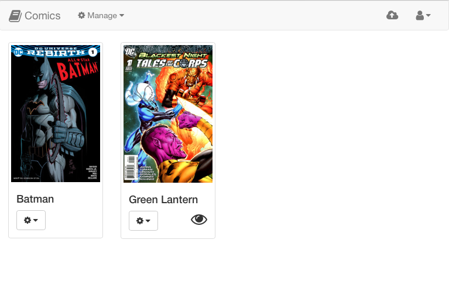
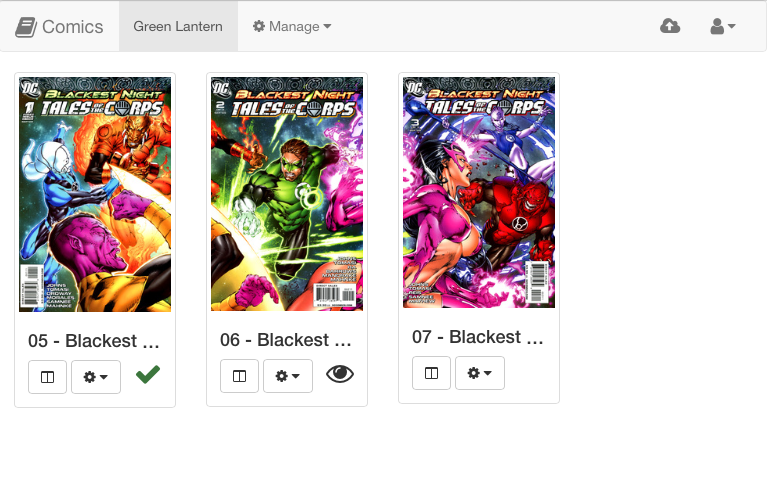
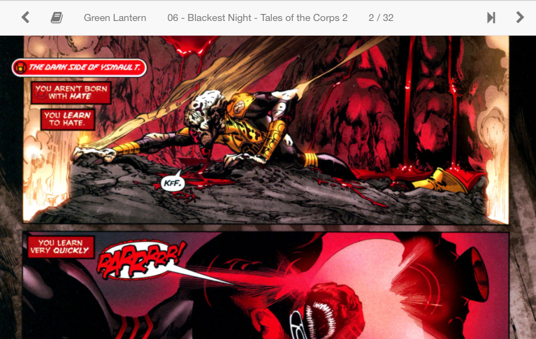

# Comics

Tablet-first comic reader.





## Development Setup

Local development is done with [Docker Compose](https://docs.docker.com/compose/) and uses the [ruby:2.3-alpine](https://hub.docker.com/r/library/ruby/tags/2.3-alpine/) and [postgres:alpine](https://hub.docker.com/r/library/postgres/tags/alpine/) repos.
Make sure you have Docker Compose installed, then run:

```
$ docker-compose up
```

Once both containers are running (`web` and `db`), run the setup helper:

```
$ docker-compose run web ./bin/setup
```

There's a wrapper script `web.sh` that can be used to run commands in the `web` container:

```
$ ./bin/web.sh rake routes
```

## Use

After the containers are running and the app is setup, hit [http://localhost:3000](http://localhost:3000) in your browser and you should be redirected to the initial User setup.
This will setup an admin account, which you can later use to add more users, etc.

## Deploy

Any Unix-like server running Ruby 2+ and Postgres 9.5+ should work.

```
./bin/web.sh cap production deploy DEPLOY_HOST=example.com
```

Set `DEPLOY_HOST` to anything capistrano's roles understands.  For example:

```
./bin/web.sh cap production deploy DEPLOY_HOST=foo@example.com:1234
```

| Requirements | | |
| ------------ |-|-|
| imagemagick | `apt-get install imagemagick` | |
| unrar | `apt-get install unrar` | (debian note: this must be the 'non-free' package) |
| unzip | `apt-get install unzip` | |
